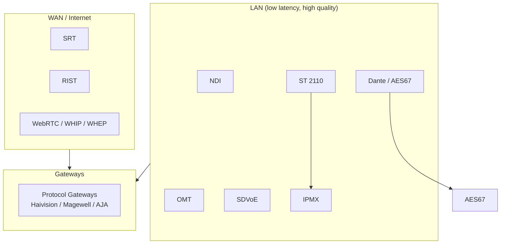

# AV over IP Research Report

Supplement to [`README.md`](../README.md) with technical background, design philosophy, and adoption notes.

---

## 1. Ecosystem Overview

AV over IP has no single winner. Protocols coexist based on **network boundary** and **quality requirements**.



### Design Philosophy

| Category | Standards | Approach |
|----------|-----------|----------|
| Ecosystem | NDI, Dante, SDVoE | SDK/Alliance-driven; interoperability within ecosystem |
| Open standards | ST 2110, AES67, IPMX, RIST | Published specs; vendor-neutral |
| Open source | SRT, OMT, librist | Source-available implementations |
| Web standards | WebRTC, WHIP, WHEP | Browser and HTTP infrastructure affinity |

---

## 2. SMPTE Family

### 2.1 ST 2110 Suite

| Part | Name | Status | Summary |
|------|------|--------|---------|
| ST 2110-10 | System Timing | Revised 2022 | PTP, RTP, SDP, common timing model |
| ST 2110-20 | Uncompressed Video | Active | Uncompressed active video |
| ST 2110-21 | Traffic Shaping | Active | Packet pacing (Narrow/Wide sender) |
| ST 2110-22 | Compressed Video | In progress | CBR compressed video |
| ST 2110-30 | PCM Audio | Revised 2025 | Uncompressed PCM |
| ST 2110-31 | AES3 Audio | Active | Non-PCM audio in AES3 |
| ST 2110-40 | Ancillary Data | Revised 2023 | SMPTE ST 291-1 ANC |
| ST 2110-41 | Fast Metadata | New 2024 | Frame-synchronized metadata framework |

### 2.2 Related Standards (ST 2001 / ST 2101 / ST 2010)

#### ST 2001-1 — Reg-XML
- **Name:** XML Representation of SMPTE Registered Data - Mapping Rules
- **Purpose:** XML mapping for SMPTE metadata registers (ST 395, ST 335, etc.)
- **AV over IP relation:** Not a transport standard; metadata description foundation for ST 2110-41
- **Reference:** [SMPTE ST 2001-1:2015](https://doi.org/10.5594/SMPTE.ST2001-1.2015)

#### ST 2101 — AC-4 in AES3
- **Name:** Format for Non-PCM Audio and Data in AES3 - AC-4 Data Type
- **Purpose:** Pack AC-4 compressed audio into AES3 streams
- **AV over IP relation:** Usable with ST 2110-31 (AES3 audio transport)
- **Reference:** [SMPTE ST 2101:2015](https://doi.org/10.5594/SMPTE.ST2101.2015)

#### ST 2010
No widely recognized SMPTE ST 2010 standard was found. Likely confusion with:

| Likely intended | Content |
|-----------------|---------|
| ST 2110-10 | ST 2110 system timing |
| ST 2022 | MPEG-2 TS over IP |
| ST 2059 | PTP clock profiles |

### 2.3 Bandwidth Reference (ST 2110-20)

| Format | Uncompressed bandwidth |
|--------|---------------------|
| 1080i59.94 | ~1.0 Gbps |
| 1080p59.94 | ~2.1 Gbps |
| 2160p59.94 (4K) | ~8.5 Gbps |
| 4K JPEG XS | ~200 Mbps+ (ratio-dependent) |

ST 2110 saves ~30% vs ST 2022-6 for 1080p50 by omitting blanking ancillary data ([RAVENNA](https://www.ravenna-network.com/introduction-to-smpte-st-2110/)).

### 2.4 NMOS

ST 2110 defines essence transport only. **NMOS** handles discovery and routing:

| Spec | Function |
|------|----------|
| IS-04 | Device/source/flow registration and discovery |
| IS-05 | Connection establishment |
| IS-07 | Events & timeline |
| IS-08 | Channel mapping |
| IS-09 | System timecar |

---

## 3. NDI

### 3.1 Version Timeline

| Version | Year | Key additions |
|---------|------|---------------|
| NDI 1.0 | 2015 | Single TCP transport; mDNS discovery |
| NDI 3 | ~2017 | UDP + Forward Error Correction |
| NDI 4 | ~2019 | Multi-TCP (MPTCP); hardware TCP offload path |
| NDI 5 | 2021 | **RUDP default**; NDI Bridge, Remote, Audio Direct |
| NDI 5.6 | 2023 | RUDP refinements; [white paper](https://ndi.video/wp-content/uploads/2023/09/NDI-5.6-White-Paper-2023.pdf) |
| NDI 6 | 2024 | Core tech refresh; HDR paths |
| NDI 6.2 | 2025 | Discovery Server control layer; receiver-side registration |
| NDI 6.3 | Jan 2026 | Advanced monitoring/control; HDCP for Pro AV; Agilex 7 FPGA; Sender Advertiser APIs |

### 3.2 Transport Protocols by NDI Version

NDI negotiates transport at connection time. If the peer doesn't support a mode, it **falls back to TCP** automatically.

| Transport | Since | Mechanism | Best for | Avoid when |
|-----------|-------|-----------|----------|------------|
| **Single TCP** | NDI 1 | Standard TCP stream | Universal compatibility | High bandwidth / many streams (head-of-line blocking) |
| **UDP + FEC** | NDI 3 | Unreliable UDP + forward error correction | Lossy links where retransmit latency is unacceptable | CPU budget on receiver is tight |
| **Multi-TCP** | NDI 4 | Multipath TCP across NICs | Multi-1GbE bonded paths with HW TCP offload | Mixed 10G/1G links; shared with Dante (creates independent TCP buffers) |
| **RUDP** | NDI 5+ (default) | Reliable UDP + aggregate multi-stream CC | Most LAN installs; wireless; high stream count | — (recommended default) |
| **Multicast UDP+FEC** | All (opt-in) | IGMP multicast fan-out | True one-to-many on well-configured LAN | **Default off** — misconfigured IGMP = network-wide DoS |

Configuration (Advanced SDK): per-instance JSON toggles for `rudp`, `multicast`, `tcp`, `udp` send/recv independently. See [configuration-files.md](https://docs.ndi.video/all/developing-with-ndi/sdk/configuration-files.md).

### 3.3 RUDP Deep Dive

**What official docs say:** RUDP combines UDP's low latency with TCP-like reliability via sequencing, selective retransmission, flow control, and congestion control — purpose-built for real-time multimedia ([NDI Protocols](https://docs.ndi.video/all/getting-started/white-paper/ndi-protocols)).

**Multi-stream congestion control** (the distinguishing design choice):

> All streams between a source are moved into a **single connection** across which congestion control is applied **in aggregate** to all streams at once. Streams are entirely non-blocking — loss on one stream cannot block others.

This differs from running N independent TCP connections (NDI 1) or N independent UDP flows (raw) where each competes for bandwidth independently.

**Kernel offload path:**
- Windows: UDP Segmentation Offload (USO), receiver-side scaling
- Linux: GSO / `UDP_SEGMENT` (kernel 4.18+) for send batching
- Packet coalescing on receive to reduce per-packet overhead

### 3.4 RUDP vs QUIC — Is NDI "QUIC-like"?

**Short answer:** Conceptually similar goals; **not** IETF QUIC and **not** wire-compatible.

| Dimension | NDI RUDP | IETF QUIC (RFC 9000) |
|-----------|----------|----------------------|
| Standardization | Proprietary (Vizrt NDI) | IETF open standard |
| Primary use | LAN live video production | General internet transport; HTTP/3 |
| Connection model | One aggregate CC context per NDI source | Connection with many bidirectional streams |
| Reliability | Sequence numbers + selective ARQ | Per-stream + connection-level loss recovery |
| Congestion control | Custom; aggregate across all NDI streams from source | Pluggable (RFC 9002); typically per-connection |
| Encryption | Not TLS-integrated | Mandatory TLS 1.3 |
| Handshake | NDI-specific (within SDK) | QUIC transport + TLS 1.3 (1-RTT / 0-RTT) |
| NAT traversal | LAN-first; NDI Bridge for remote | Designed for internet path migration |
| Multiplexing | All source streams share one CC pipe | Independent stream flow control within connection |

**Why people say "QUIC-like":**
1. Both run reliability on top of UDP instead of TCP
2. Both multiplex multiple logical streams without head-of-line blocking
3. Both implement modern congestion control (vs naive TCP over high-BDP links)
4. Third-party articles (e.g. [AVNetwork 2021](https://www.avnetwork.com/news/how-ndi-5-impacts-avoip-remote-live-production)) have explicitly called RUDP "QUIC" — this is **not supported by official NDI technical documentation**, which never references RFC 9000 or QUIC by name

**Practical implication:** You cannot point a QUIC client at an NDI source. NDI Bridge / Remote handle WAN traversal with NDI's own stack, not standard QUIC.

### 3.5 Codec Profiles

| Profile | Codec | 1080p60 bandwidth | Notes |
|---------|-------|-------------------|-------|
| High Bandwidth | SHQ (proprietary) | ~100–200 Mbps | Default quality path; YCbCr preferred |
| HX | H.264 | ~8–12 Mbps | Camera firmware / embedded |
| HX2 | H.264 (improved) | ~6–10 Mbps | HX successor |
| HX3 | H.265/HEVC | ~4–8 Mbps | Advanced SDK; passthrough on supported hardware |

### 3.6 Standard SDK vs Advanced SDK

| Capability | Standard SDK | Advanced SDK |
|------------|-------------|--------------|
| Target | Software apps, hobbyists | Hardware OEMs, broadcast integrators |
| License | Free (non-commercial request) | Commercial ([sales@ndi.video](mailto:sales@ndi.video)) |
| HDR 10-bit+ | Limited | Full encode/decode |
| HX3 passthrough/decode | — | ✓ |
| KVM | — | ✓ |
| Genlock / AV sync | — | ✓ |
| JSON per-instance config | — | ✓ (transport, NIC, codec, discovery) |
| FPGA IP / embedded | — | ✓ |
| CLI recording | — | ✓ |
| Certification path | NDI Certified program | NDI Advanced + certification |

Sources: [SDK vs Advanced FAQ](https://docs.ndi.video/all/faq/sdk/what-are-the-differences-between-the-ndi-sdk-and-the-ndi-advanced-sdk), [Advanced SDK docs](https://docs.ndi.video/all/developing-with-ndi/advanced-sdk)

### 3.7 Open Source Ecosystem

| Repo | Role | Notes |
|------|------|-------|
| [DistroAV](https://github.com/DistroAV/DistroAV) | OBS integration | Requires NDI Runtime; GPL-2.0 |
| [grafton-ndi](https://github.com/GrantSparks/grafton-ndi) | Rust NDI 6 bindings | Apache-2.0; unofficial; async + PTZ |
| [grafton-birddog](https://github.com/GrantSparks/grafton-birddog) | BirdDog camera API in Rust | Companion project |

No independent open-source NDI protocol implementation exists — all tools require the proprietary NDI SDK/Runtime.

### 3.8 Activity Snapshot (Aug 2026)

See [`activity.md`](activity.md#ndi) for full metrics. Summary: **5/5 activity score** — NDI 6.3 shipped Jan 2026, 600+ vendors, DistroAV and grafton-ndi actively maintained.

---

## 4. OMT

### Protocol Stack

Three components ([PROTOCOL.md](https://github.com/openmediatransport/libomtnet/blob/main/PROTOCOL.md)):

1. TCP protocol — video, audio, metadata frames
2. Metadata commands — XML connection control
3. DNS-SD — source discovery (RFC 6763)

### Frame Layout

```
[HEADER 16B][EXTENDED HEADER 24–32B][DATA][METADATA XML]
```

- Timestamp: 100 ns ticks (10,000,000 = 1 second)
- Video: VMX1 FourCC; Audio: FPA1 (32-bit float planar)

### NDI Comparison

| Aspect | NDI | OMT |
|--------|-----|-----|
| License | Free SDK, closed spec | MIT, open spec |
| Multicast | Yes | No (TCP unicast only) |
| Ecosystem | Very large | Growing (vMix/Sienna core) |
| Alpha channel | Yes | Yes (4:4:4:4) |
| Discovery | mDNS | DNS-SD + Discovery Server |

### Open Source Implementations

| Repo | Language | Role |
|------|----------|------|
| openmediatransport/libomtnet | C# | Official reference |
| openmediatransport/libvmx | C | VMX1 codec |
| openmediatransport/omtplugin | C# | OBS plugin |
| MikanseiLaboratory/openmediatransport-rs | Rust | Community full stack |
| MikanseiLaboratory/vmx-rs | Rust | Community codec |
| MikanseiLaboratory/omt-tools | Rust/Tauri | Tooling |

**Activity:** 3/5 score, ↑↑ momentum — see [`activity.md`](activity.md#omt). Protocol age ~1 year; official repos actively pushed through mid-2026.

---

## 5. SRT

### Features
- ARQ retransmission, optional FEC
- AES-128/256 encryption
- Caller / Listener / Rendezvous modes

### Latency Tuning

| Setting | Latency | Use |
|---------|---------|-----|
| 120 ms | Ultra-low | Remote production |
| 500 ms | Standard | General contribution |
| 2000 ms+ | Stability-first | Unreliable links |

### Open Source
- [Haivision/srt](https://github.com/Haivision/srt) — reference library (v1.5.6, Jul 2026)
- Integrated in FFmpeg, GStreamer, OBS, VLC

**Activity:** 5/5 score — see [`activity.md`](activity.md#srt). 650+ alliance members; libsrt maintained with regular releases.

---

## 6. WebRTC / WHIP / WHEP

### Problem Solved
Traditional WebRTC lacked standardized server ingest/egress signaling. WHIP/WHEP replace proprietary signaling with HTTP POST + SDP exchange.

| Protocol | Direction | Mechanism |
|----------|-----------|-----------|
| WHIP | Publisher → Server | HTTP POST SDP |
| WHEP | Server → Player | HTTP POST SDP |

### Adoption (2024–2026)
- OBS: native WHIP output
- FFmpeg: WHIP/WHEP in development
- Cloudflare, Red5, Dolby OptiView: cloud WHIP/WHEP
- Larix Broadcaster: mobile WHIP

---

## 7. Other Standards

### AES67 vs Dante vs RAVENNA

| Item | Dante | RAVENNA | AES67 |
|------|-------|---------|-------|
| Type | Proprietary | Open AoIP | Interop standard |
| Market share | ~90% Pro AV audio | Broadcast/high-end | Bridge use |
| Discovery | Dante Controller | RAVENNA / NMOS | Manual SDP |
| ST 2110 | Limited | Native | ST 2110-30 compatible |

### RIST Profiles

| Profile | Features |
|---------|----------|
| Simple | Basic ARQ |
| Main | Encryption + extensions |
| Advanced | Tunneling (can carry ST 2110, MPEG-TS) |

### SDVoE vs IPMX

| Item | SDVoE | IPMX |
|------|-------|------|
| Foundation | Semtech proprietary | ST 2110 + NMOS |
| Bandwidth | 10GbE required | 1GbE possible (JPEG XS) |
| Latency | <100 μs | Low (config-dependent) |
| Open | No | Yes |

---

## 8. Reference Links

| Standard | URL |
|----------|-----|
| SMPTE ST 2110 | https://www.smpte.org/standards/st2110 |
| NDI | https://ndi.video/ |
| OMT | https://openmediatransport.org/ |
| SRT | https://www.srtalliance.org/ |
| RIST | https://www.rist.tv/ |
| WebRTC | https://webrtc.org/ |
| WHIP (RFC 9725) | https://datatracker.ietf.org/doc/rfc9725/ |
| AES67 | https://www.aes.org/standards/ |
| Dante | https://www.getdante.com/ |
| RAVENNA | https://www.ravenna-network.com/ |
| SDVoE | https://sdvoe.org/ |
| IPMX | https://ipmx.io/ |
| NMOS | https://specs.amwa.tv/nmos/ |
| AIMS Alliance | https://aimsalliance.org/ |

---

*Last updated: August 2026*
