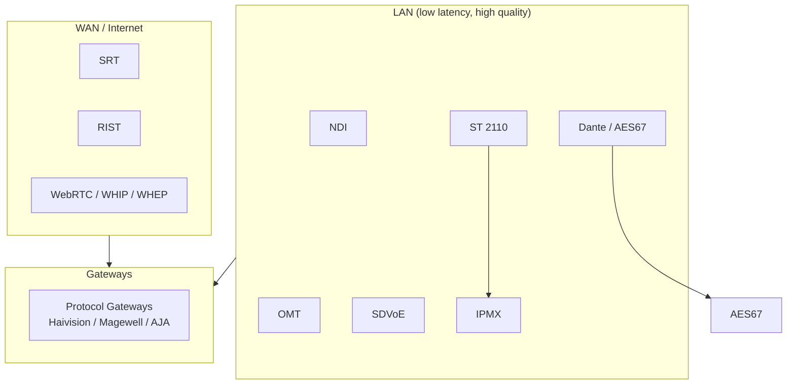

# AV over IP Research Report

Supplement to [`README.md`](../README.md) with technical background, design philosophy, and adoption notes.

---

## 1. Ecosystem Overview

AV over IP has no single winner. Protocols coexist based on **network boundary** and **quality requirements**.



### Design Philosophy

| Category | Standards | Approach |
|----------|-----------|----------|
| Ecosystem | NDI, Dante, SDVoE | SDK/Alliance-driven; interoperability within ecosystem |
| Open standards | ST 2110, AES67, IPMX, RIST | Published specs; vendor-neutral |
| Open source | SRT, OMT, librist | Source-available implementations |
| Web standards | WebRTC, WHIP, WHEP | Browser and HTTP infrastructure affinity |

---

## 2. SMPTE Family

### 2.1 ST 2110 Suite

| Part | Name | Status | Summary |
|------|------|--------|---------|
| ST 2110-10 | System Timing | Revised 2022 | PTP, RTP, SDP, common timing model |
| ST 2110-20 | Uncompressed Video | Active | Uncompressed active video |
| ST 2110-21 | Traffic Shaping | Active | Packet pacing (Narrow/Wide sender) |
| ST 2110-22 | Compressed Video | In progress | CBR compressed video |
| ST 2110-30 | PCM Audio | Revised 2025 | Uncompressed PCM |
| ST 2110-31 | AES3 Audio | Active | Non-PCM audio in AES3 |
| ST 2110-40 | Ancillary Data | Revised 2023 | SMPTE ST 291-1 ANC |
| ST 2110-41 | Fast Metadata | New 2024 | Frame-synchronized metadata framework |

### 2.2 Related Standards (ST 2001 / ST 2101 / ST 2010)

#### ST 2001-1 — Reg-XML
- **Name:** XML Representation of SMPTE Registered Data - Mapping Rules
- **Purpose:** XML mapping for SMPTE metadata registers (ST 395, ST 335, etc.)
- **AV over IP relation:** Not a transport standard; metadata description foundation for ST 2110-41
- **Reference:** [SMPTE ST 2001-1:2015](https://doi.org/10.5594/SMPTE.ST2001-1.2015)

#### ST 2101 — AC-4 in AES3
- **Name:** Format for Non-PCM Audio and Data in AES3 - AC-4 Data Type
- **Purpose:** Pack AC-4 compressed audio into AES3 streams
- **AV over IP relation:** Usable with ST 2110-31 (AES3 audio transport)
- **Reference:** [SMPTE ST 2101:2015](https://doi.org/10.5594/SMPTE.ST2101.2015)

#### ST 2010
No widely recognized SMPTE ST 2010 standard was found. Likely confusion with:

| Likely intended | Content |
|-----------------|---------|
| ST 2110-10 | ST 2110 system timing |
| ST 2022 | MPEG-2 TS over IP |
| ST 2059 | PTP clock profiles |

### 2.3 Bandwidth Reference (ST 2110-20)

| Format | Uncompressed bandwidth |
|--------|---------------------|
| 1080i59.94 | ~1.0 Gbps |
| 1080p59.94 | ~2.1 Gbps |
| 2160p59.94 (4K) | ~8.5 Gbps |
| 4K JPEG XS | ~200 Mbps+ (ratio-dependent) |

ST 2110 saves ~30% vs ST 2022-6 for 1080p50 by omitting blanking ancillary data ([RAVENNA](https://www.ravenna-network.com/introduction-to-smpte-st-2110/)).

### 2.4 NMOS

ST 2110 defines essence transport only. **NMOS** handles discovery and routing:

| Spec | Function |
|------|----------|
| IS-04 | Device/source/flow registration and discovery |
| IS-05 | Connection establishment |
| IS-07 | Events & timeline |
| IS-08 | Channel mapping |
| IS-09 | System timecar |

---

## 3. NDI

### Profiles

| Profile | Method | 1080p60 bandwidth | Use |
|---------|--------|-------------------|-----|
| High Bandwidth | Proprietary (SHQ) | ~100–200 Mbps | Highest LAN quality |
| HX / HX2 | H.264 | ~6–12 Mbps | Bandwidth-constrained |
| HX3 | H.265/HEVC | ~4–8 Mbps | Lowest bandwidth |

### Open Source Notes

NDI protocol is proprietary. OSS tools wrap the NDI SDK:

- **DistroAV** — GPL-2.0 OBS plugin; requires [NDI Runtime](https://ndi.video/)
- No fully independent open NDI protocol implementation exists

---

## 4. OMT

### Protocol Stack

Three components ([PROTOCOL.md](https://github.com/openmediatransport/libomtnet/blob/main/PROTOCOL.md)):

1. TCP protocol — video, audio, metadata frames
2. Metadata commands — XML connection control
3. DNS-SD — source discovery (RFC 6763)

### Frame Layout

```
[HEADER 16B][EXTENDED HEADER 24–32B][DATA][METADATA XML]
```

- Timestamp: 100 ns ticks (10,000,000 = 1 second)
- Video: VMX1 FourCC; Audio: FPA1 (32-bit float planar)

### NDI Comparison

| Aspect | NDI | OMT |
|--------|-----|-----|
| License | Free SDK, closed spec | MIT, open spec |
| Multicast | Yes | No (TCP unicast only) |
| Ecosystem | Very large | Growing (vMix/Sienna core) |
| Alpha channel | Yes | Yes (4:4:4:4) |
| Discovery | mDNS | DNS-SD + Discovery Server |

### Open Source Implementations

| Repo | Language | Role |
|------|----------|------|
| openmediatransport/libomtnet | C# | Official reference |
| openmediatransport/libvmx | C | VMX1 codec |
| openmediatransport/omtplugin | C# | OBS plugin |
| MikanseiLaboratory/openmediatransport-rs | Rust | Community full stack |
| MikanseiLaboratory/vmx-rs | Rust | Community codec |
| MikanseiLaboratory/omt-tools | Rust/Tauri | Tooling |

---

## 5. SRT

### Features
- ARQ retransmission, optional FEC
- AES-128/256 encryption
- Caller / Listener / Rendezvous modes

### Latency Tuning

| Setting | Latency | Use |
|---------|---------|-----|
| 120 ms | Ultra-low | Remote production |
| 500 ms | Standard | General contribution |
| 2000 ms+ | Stability-first | Unreliable links |

### Open Source
- [Haivision/srt](https://github.com/Haivision/srt) — reference library
- Integrated in FFmpeg, GStreamer, OBS, VLC

---

## 6. WebRTC / WHIP / WHEP

### Problem Solved
Traditional WebRTC lacked standardized server ingest/egress signaling. WHIP/WHEP replace proprietary signaling with HTTP POST + SDP exchange.

| Protocol | Direction | Mechanism |
|----------|-----------|-----------|
| WHIP | Publisher → Server | HTTP POST SDP |
| WHEP | Server → Player | HTTP POST SDP |

### Adoption (2024–2026)
- OBS: native WHIP output
- FFmpeg: WHIP/WHEP in development
- Cloudflare, Red5, Dolby OptiView: cloud WHIP/WHEP
- Larix Broadcaster: mobile WHIP

---

## 7. Other Standards

### AES67 vs Dante vs RAVENNA

| Item | Dante | RAVENNA | AES67 |
|------|-------|---------|-------|
| Type | Proprietary | Open AoIP | Interop standard |
| Market share | ~90% Pro AV audio | Broadcast/high-end | Bridge use |
| Discovery | Dante Controller | RAVENNA / NMOS | Manual SDP |
| ST 2110 | Limited | Native | ST 2110-30 compatible |

### RIST Profiles

| Profile | Features |
|---------|----------|
| Simple | Basic ARQ |
| Main | Encryption + extensions |
| Advanced | Tunneling (can carry ST 2110, MPEG-TS) |

### SDVoE vs IPMX

| Item | SDVoE | IPMX |
|------|-------|------|
| Foundation | Semtech proprietary | ST 2110 + NMOS |
| Bandwidth | 10GbE required | 1GbE possible (JPEG XS) |
| Latency | <100 μs | Low (config-dependent) |
| Open | No | Yes |

---

## 8. Reference Links

| Standard | URL |
|----------|-----|
| SMPTE ST 2110 | https://www.smpte.org/standards/st2110 |
| NDI | https://ndi.video/ |
| OMT | https://openmediatransport.org/ |
| SRT | https://www.srtalliance.org/ |
| RIST | https://www.rist.tv/ |
| WebRTC | https://webrtc.org/ |
| WHIP (RFC 9725) | https://datatracker.ietf.org/doc/rfc9725/ |
| AES67 | https://www.aes.org/standards/ |
| Dante | https://www.getdante.com/ |
| RAVENNA | https://www.ravenna-network.com/ |
| SDVoE | https://sdvoe.org/ |
| IPMX | https://ipmx.io/ |
| NMOS | https://specs.amwa.tv/nmos/ |
| AIMS Alliance | https://aimsalliance.org/ |

---

*Last updated: August 2026*
